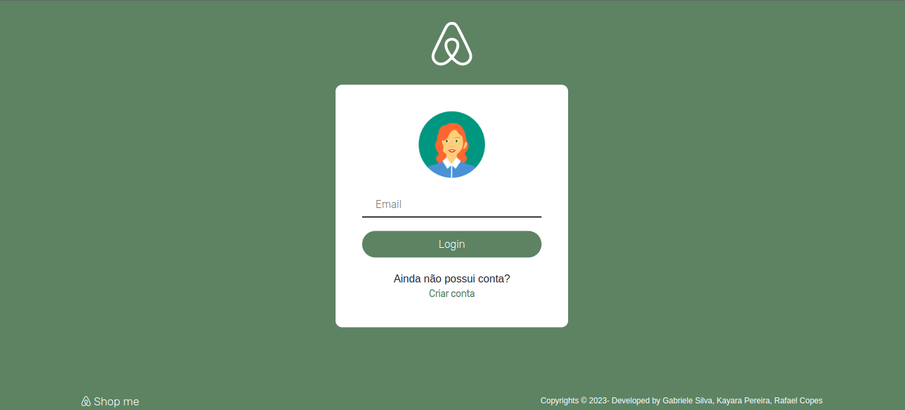

# Shop me - Ecommerce com Algoritmo de Recomendação em Banco de Dados Orientado a Grafo

Este repositório contém um projeto de simulação de um e-commerce, demonstrando o funcionamento de um algoritmo de recomendação utilizando um banco de dados orientado a grafo.

## Descrição

O objetivo deste projeto é exemplificar o uso de um algoritmo de recomendação em um cenário de e-commerce. O algoritmo utiliza um banco de dados orientado a grafo para armazenar informações sobre produtos, clientes, compras e visualizações de produtos. Ele é capaz de analisar o histórico de compras dos clientes e suas interações com os produtos para fazer recomendações personalizadas.

## Funcionalidades

O projeto possui as seguintes funcionalidades:

- **Cadastro de Clientes**: Permite o cadastro de novos clientes no sistema.
- **Cadastro de Produtos**: Permite o cadastro de produtos no sistema através de um arquivo json.
- **Realização de Compras**: Permite que os clientes realizem compras de produtos.
- **Recomendação de Produtos**: Com base no histórico de compras e visualizações de produtos do cliente, o algoritmo de recomendação sugere produtos relevantes.

## Banco de Dados Orientado a Grafo

O projeto utiliza um banco de dados orientado a grafo para armazenar as informações. Isso permite a representação das relações entre clientes e produtos de forma eficiente, facilitando a consulta e a geração de recomendações.

## Algoritmo de Recomendação

O projeto utiliza um algoritmo de recomendação baseado na similaridade de usuários, calculada por meio do cálculo do coeficiente de similaridade de cossenos. Esse algoritmo permite comparar o histórico de compras e preferências dos usuários para encontrar usuários similares e, com base nessa similaridade, recomendar produtos relevantes.

O processo de recomendação ocorre da seguinte maneira:

1. **Coleta de Dados**: O algoritmo coleta informações sobre as interações realizadas pelos usuários com os produtos, como visualizações e compras.

2. **Cálculo da Similaridade**: Com base nos dados coletados, o algoritmo calcula a similaridade entre os usuários usando o coeficiente de similaridade de cossenos. Esse cálculo envolve a comparação dos padrões de compras e visualizações entre os usuários.

3. **Identificação de Usuários Similares**: Com o cálculo da similaridade, o algoritmo identifica os usuários que possuem padrões de compras e preferências semelhantes.

4. **Recomendação de Produtos**: Com base nos usuários similares, o algoritmo seleciona os produtos que foram adquiridos ou visualizados por esses usuários. Após isso os produtos passam por uma etapa de atribuição de "score", e os que alcançam as melhores pontuações são recomendados.

## Uso

Para executar o projeto e simular o funcionamento do e-commerce com o algoritmo de recomendação, siga as etapas abaixo:

1. Certifique-se de ter o banco de dados OrientDb instalado e modelado com as Arestas e Nodos necessários.
2. Inicie a execução da aplicação com o comando 'nodemon start'.
3. Importe os dados de exemplo para o banco de dados através da rota '/criarProdutos'.

## Visão Geral do App

## Contato dos Desenvolvedores
Esse projeto foi desenvolvido por:
- [Gabriele Silva](https://github.com/SLGabi)
- [Kayara Silveira](https://github.com/KayaraSilveira)
- [Rafael Copes](https://github.com/RafaelCopes)
